<div align="center">

# AUC Library Assistant & Agent Kit

**Cited answers about AUC Libraries in English, Arabic and Franco-Arabic: OCR, hybrid RAG, guarded chat and a staff dashboard, plus 20 lean agent definitions for building agents for any purpose.**

[](https://github.com/Abdelrahman-sadek/AUC-starterkit/actions)


-2ea44f)


[Screenshots](#screenshots) · [Features](#features) · [Architecture](#architecture) · [Quick start](#quick-start) · [Server requirements](#server-requirements) · [Local models](#running-on-local-models) · [Evaluation](#quality-and-evaluation) · [Agents](#agent-kit) · [Docs](#documentation) · [العربية](README.ar.md)

</div>

> Independent project, not affiliated with or endorsed by The American University in Cairo. The seed pages paraphrase public AUC pages with their URLs; facts marked `[VERIFY]` wait for AUC staff. Thesis records in `samples/fixtures/` are fictional.

---

## Screenshots

<table>
<tr>
<td width="50%">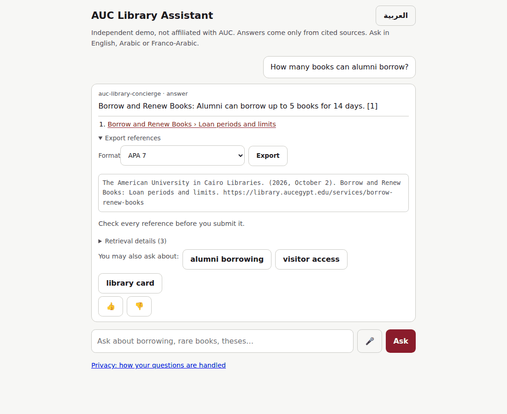<br><sub><b>Chat (English)</b>: cited answer, source link, reference export (APA shown), related topics, feedback</sub></td>
<td width="50%">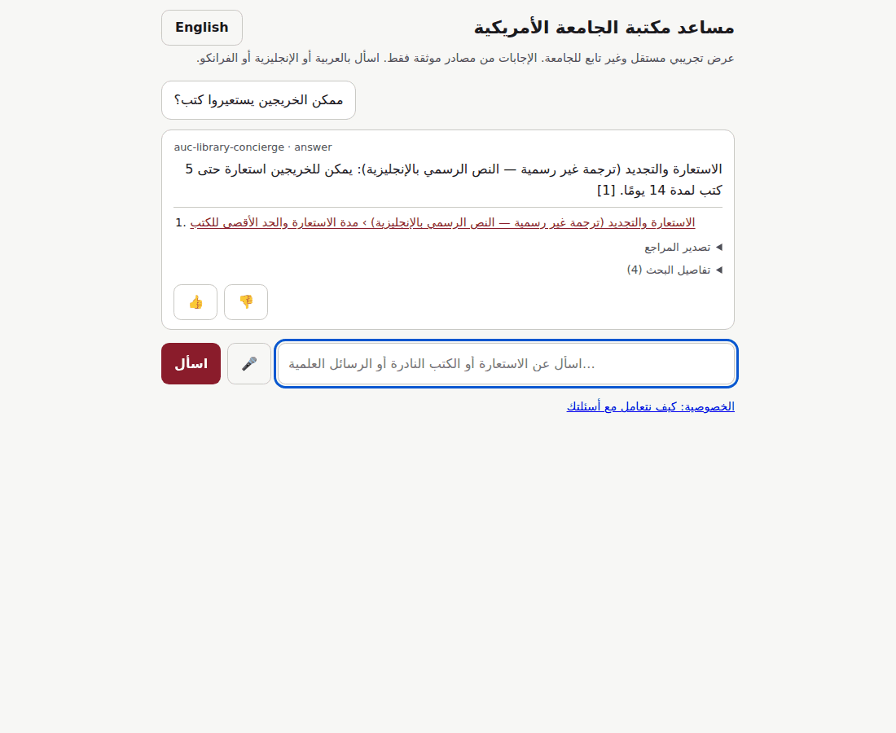<br><sub><b>Chat (Arabic, RTL)</b>: Egyptian Arabic question answered from the Arabic version of the page</sub></td>
</tr>
<tr>
<td>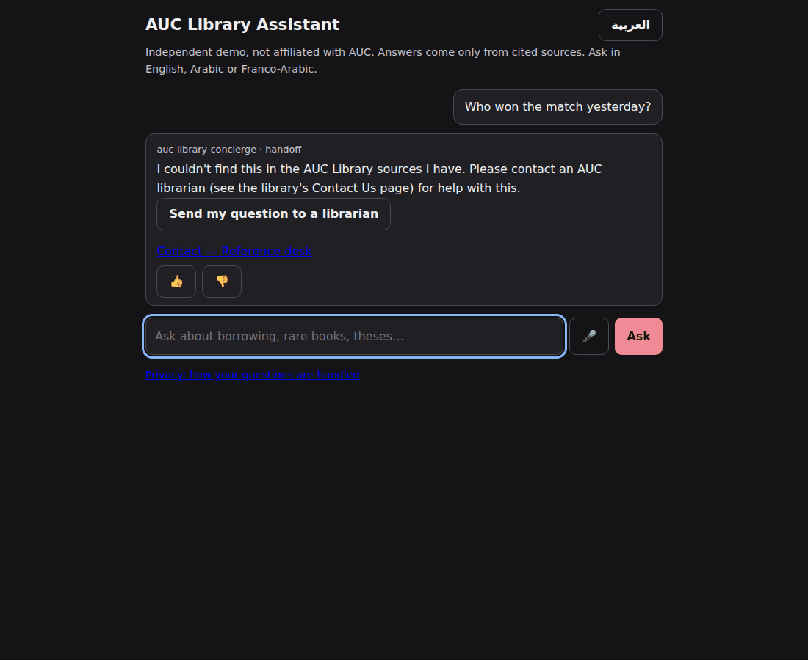<br><sub><b>Handoff (dark mode)</b>: out-of-scope question goes to a librarian with a consent form</sub></td>
<td>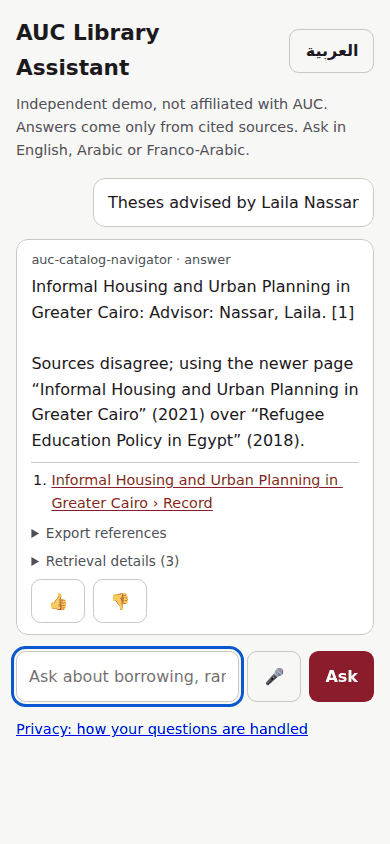<br><sub><b>Mobile</b>: thesis search filtered by advisor</sub></td>
</tr>
</table>

**Staff dashboard**: 14 tabs in five groups, with viewer, staff and admin roles.

<table>
<tr>
<td width="50%">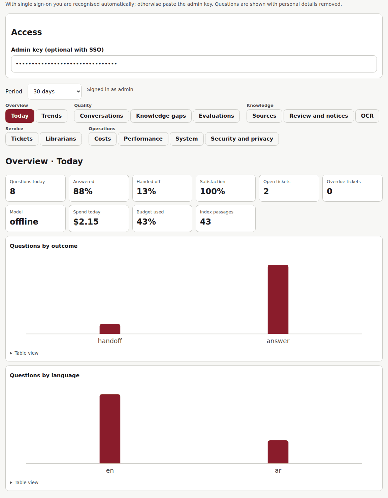<br><sub><b>Overview › Today</b>: questions, answered and handed-off share, satisfaction, tickets, spend, model status</sub></td>
<td width="50%">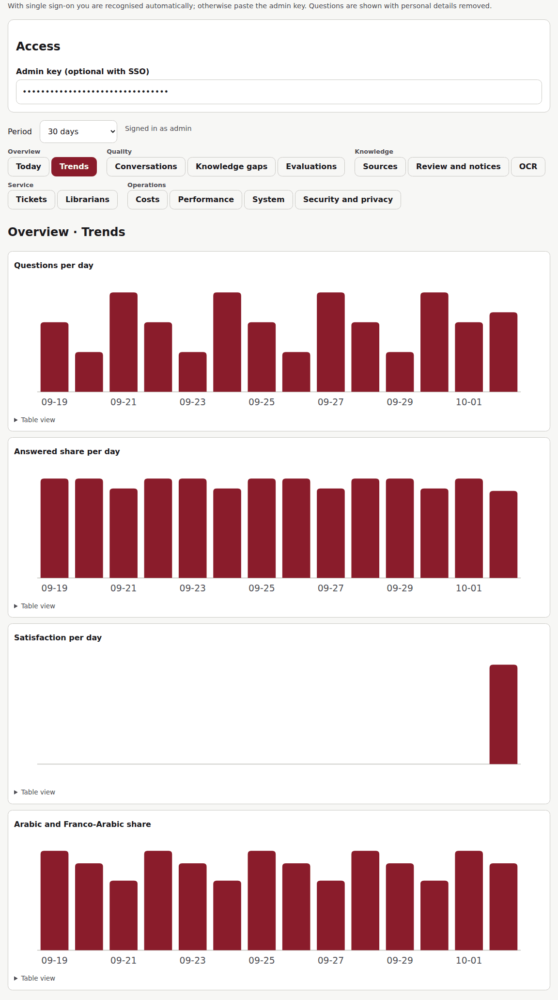<br><sub><b>Overview › Trends</b>: volume, answered share, satisfaction and Arabic share per day</sub></td>
</tr>
<tr>
<td>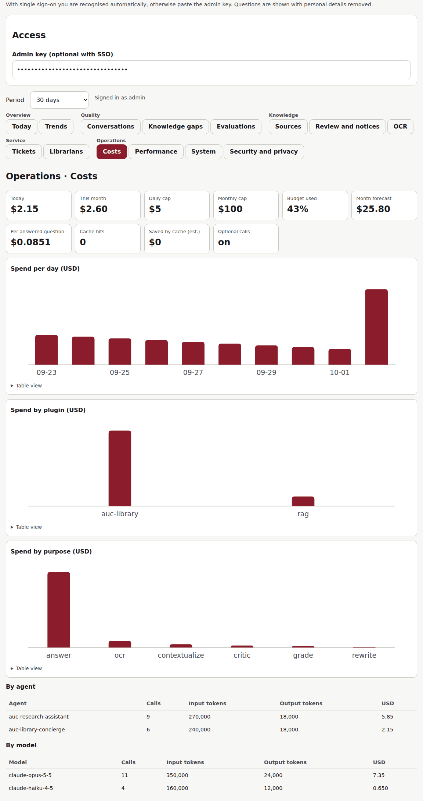<br><sub><b>Operations › Costs</b>: spend against daily and monthly caps, forecast, by plugin, purpose, agent and model</sub></td>
<td>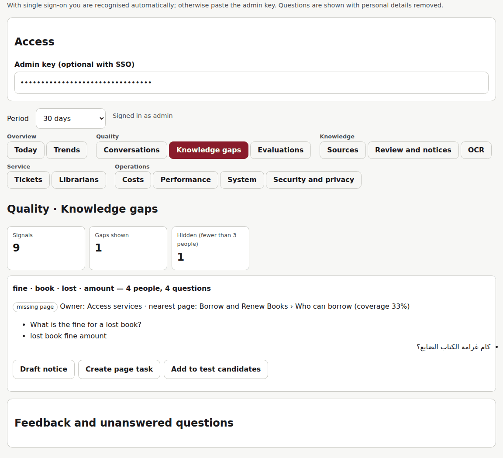<br><sub><b>Quality › Knowledge gaps</b>: unanswered questions grouped across EN/AR/Franco, with owner and actions</sub></td>
</tr>
<tr>
<td>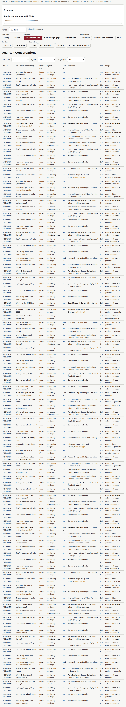<br><sub><b>Quality › Conversations</b>: redacted questions with outcome, agent, sources, latency and pipeline steps</sub></td>
<td>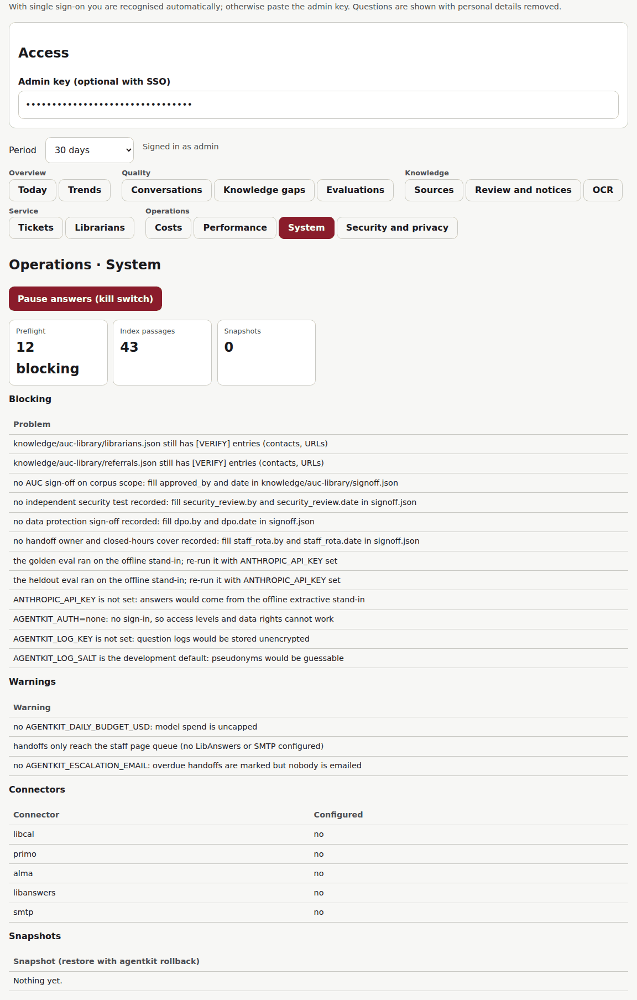<br><sub><b>Operations › System</b>: preflight checklist, kill switch, connectors, snapshots, local model servers</sub></td>
</tr>
<tr>
<td>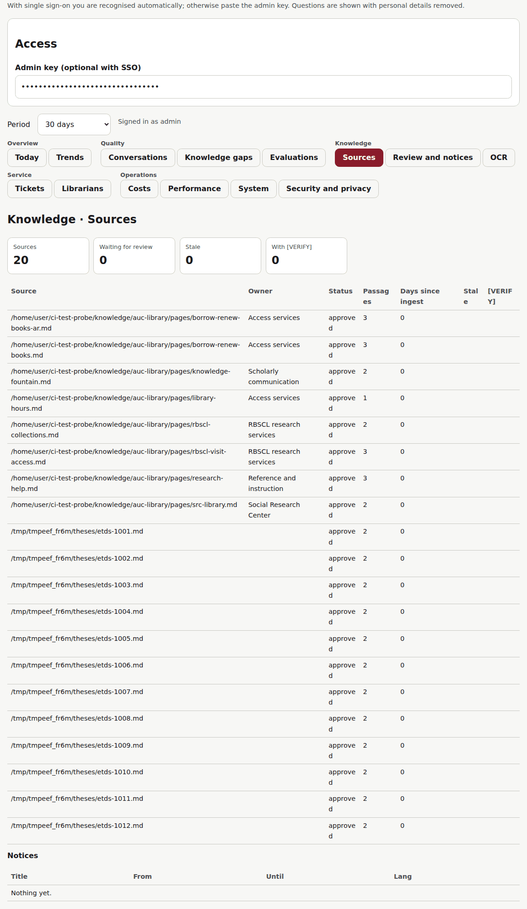<br><sub><b>Knowledge › Sources</b>: owner, review status, freshness and [VERIFY] flags per source</sub></td>
<td>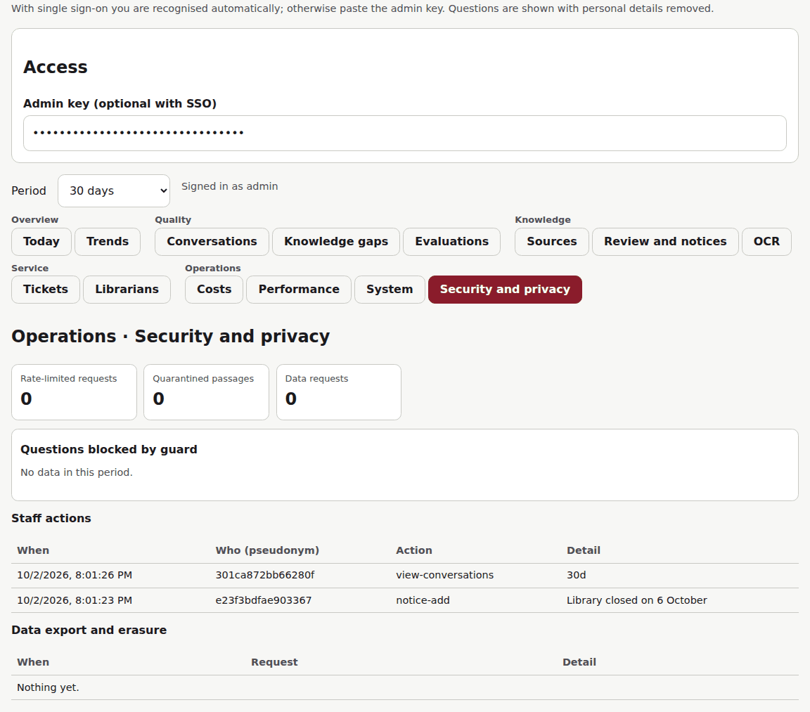<br><sub><b>Operations › Security and privacy</b>: blocked attacks, quarantined passages, staff audit trail, data requests</sub></td>
</tr>
<tr>
<td>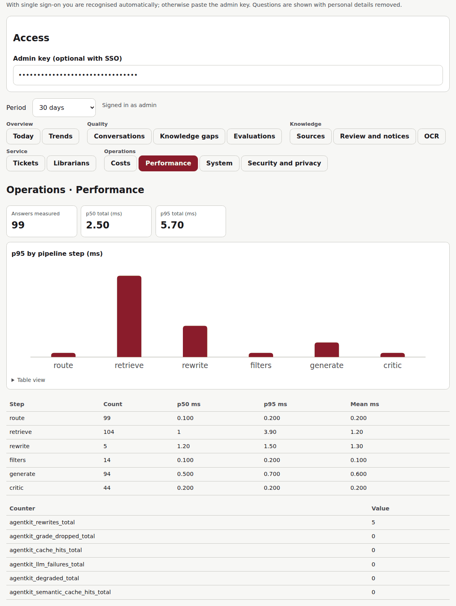<br><sub><b>Operations › Performance</b>: p50/p95 per pipeline step from request traces</sub></td>
<td>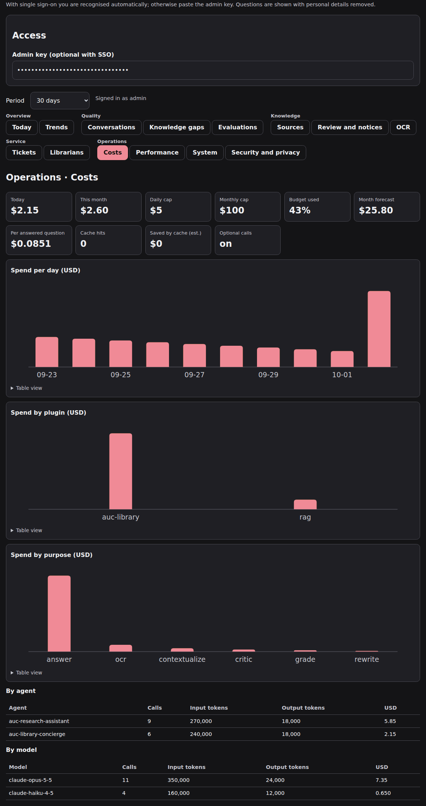<br><sub><b>Dark mode</b>: every page follows the system colour scheme</sub></td>
</tr>
</table>

More: [tickets](docs/screenshots/dashboard-tickets.png) · [evaluations](docs/screenshots/dashboard-evaluations.png) · [OCR](docs/screenshots/dashboard-ocr.png) · [rare-materials request form](docs/screenshots/request-form.png) · [privacy page](docs/screenshots/privacy.png). Regenerate all of them with `python scripts/screenshots.py`.

---

## Features

### Chat
- **Three languages, one index.** English, Modern Standard and Egyptian Arabic, and Franco-Arabic (`momken a7gez ma3ad?`). Arabic is normalised (alef, yaa, taa marbuta, diacritics, digits), stemmed, and Franco is transliterated. An Egyptian glossary covers words like كارنيه, الدور and maw3ed.
- **Answers only from sources.** Every sentence cites a numbered source, and quotes are checked verbatim against the passage. If nothing relevant is found, the question goes to a librarian; the assistant does not guess.
- **Routing to five AUC agents:** concierge, research assistant, catalog navigator, special collections guide, guardrails. Research questions with no match get a search strategy instead of invented titles.
- **Agentic retrieval.** Retrieve, then grade the passages (live mode), then rewrite the query and retry once before handing off. The offline rewrite fixes spelling against the index vocabulary.
- **Evaluator-critic.** Research and policy answers are checked before they are shown. Each number must keep its unit ("5 books", not a "5" from a fine). quotes, numbers, links and style, then (live mode) a fast-model score. One revision is allowed; otherwise the answer becomes a handoff that keeps the source links.
- **Guardrails.** Prompt injection (EN/AR/Franco), credential and private-data requests, writing graded work, crisis messages and other universities' libraries are all caught before the model is called.
- **Streaming, caching and resilience.** Answers stream; there is an exact-match cache plus an optional semantic cache with strict safety rules. A circuit breaker and daily budget fall back to "search results only" answers with a banner.
- **Answer style.** Greetings, praise, closing offers and buzzwords are removed in English and Arabic (rules adapted from [antislop](https://github.com/miqdadbadjuber/anti-slop)) without touching cited sentences.

### Search and knowledge (RAG)
- **Hybrid search.** BM25 on stemmed words plus character trigrams, fused with Reciprocal Rank Fusion. Optional BGE-M3 dense vectors (Qdrant) and a bge-reranker.
- **Two storage back ends.** SQLite FTS5 on disk (p95 40 ms at 20k chunks on 4 vCPU), or an in-memory JSON index.
- **Ingestion safety.** Only https sources on an allowlist are ingested, with SHA-256 provenance. Changed sources wait for staff review, and instruction-like text is quarantined. Parsing runs in a sandbox with size, page, time and memory caps.
- **Freshness and dates.** Notices and pages can have start and end dates; live hours and rooms come from LibCal; a newer page beats an older one unless they address different audiences; a stale-source report flags old pages.
- **Undo.** Every ingest takes a snapshot first; `agentkit rollback` restores one, even over a corrupt index.

### OCR
- Scanned and photographed PDFs, and PDFs with broken Arabic text layers. Word-box layout handles columns, right-to-left order and tables.
- Image clean-up (deskew, upscale, adaptive denoise) and two-pass Tesseract; Claude vision or a local vision model when configured.
- Per-page confidence. Pages below 0.7 go to a staff correction queue, and answers citing an unchecked scan say so.
- Exports: accessible HTML, searchable PDF with an invisible text layer, and archival finding aids (EAD).

### AUC library services
- **Handoff.** Tickets go to LibAnswers, then email, then a staff queue, so a request is never lost. The right subject librarian is chosen automatically, there is SLA escalation, and email is only shared with consent.
- **Live data.** Hours and rooms (LibCal), catalog availability (Primo), and read-only account answers (Alma; never cached, logged or sent to the model).
- **Rare materials.** Request form with rights notice; finding aids indexed.
- **Referrals.** Registration, IT, finance and wellness questions go to the right campus office.

### Research tools
- **Reference export** from any answer: APA 7, MLA 9, BibTeX, RIS (Zotero, Mendeley, EndNote), EndNote `.enw` and CSL-JSON. Only fields the source provides are exported.
- **Thesis search.** Run nightly from cron; a record that is deleted or newly embargoed upstream is removed from the index on the next run. `agentkit harvest-theses` pulls open-access theses from the repository over OAI-PMH. It resumes after interruption and skips embargoed, deleted and non-thesis records. Questions such as "economics theses since 2020 supervised by Sara Ibrahim" are filtered by department, advisor and year; `/api/search` accepts the same filters.

### Staff dashboard
- **14 tabs in five groups:**
  - Overview: today, trends.
  - Quality: conversations, knowledge gaps, evaluations.
  - Knowledge: sources, review and notices, OCR.
  - Service: tickets, librarians.
  - Operations: costs, performance, system, security.
- **Roles from directory groups.** Viewers see Overview and Quality; staff add Knowledge and Service actions; admins see Operations and the kill switch.
- **Costs.**
  - Every model call is stored with plugin, agent and purpose (answer, grade, rewrite, critic, OCR), so spend survives restarts.
  - Alerts at 50/80/95 % go out by email or webhook.
  - A soft brake at 80 % pauses the optional calls (grading, rewriting, critic). Answers continue normally.
  - At the cap, or when the next call's estimated cost would cross it, answers come from search results with a banner. Nothing is queued or rejected.
  - Each call reserves its estimated cost before running, so parallel requests cannot overshoot the cap.
- **Knowledge gaps.** Unanswered and thumbs-down questions are grouped across languages. A group is shown only when at least 3 people asked, and buttons draft a notice, file a page task or add test cases.
- **Conversations are staff-only.** Questions are shown redacted, and a stated reason for access is required and logged. Stored answers follow the 30-day retention.
- **Accessible.** Every tab passes axe-core (WCAG 2.2 AA) in Chromium, works from the keyboard, and each chart has a table view and per-bar tooltips.

### Security and privacy
- **Identity.**
  - Sign-in through OIDC/JWT (JWKS), or an SSO proxy with a shared secret against spoofed identity headers.
  - Directory groups map to document access levels.
- **Data protection.**
  - Questions are redacted before the model sees them (emails, national ID, Luhn-checked cards, phones).
  - Logs are pseudonymous and Fernet-encrypted, with 30-day retention.
  - Users can download or delete their own data; there is a privacy page in EN/AR.
- **Hardening.**
  - Strict CSP, rate limits, body caps, security headers, a staff audit log and HTTPS through Caddy.
  - Mapped to the OWASP Top 10 for LLM applications.
- **Go/no-go gate.** `agentkit preflight` blocks real users until evals have run on the live model, on the current index and config, no `[VERIFY]` facts remain, AUC sign-offs are recorded (scope, security test, data protection, staff rota) and secrets are set.

### Accessibility and channels
- WCAG 2.2 AA chat, staff, request and privacy pages; full Arabic RTL interface; voice input; dark mode; mobile layout.
- Embeddable widget (`/widget.js`), WhatsApp channel, MCP server, and a CLI for everything.

---

## Architecture

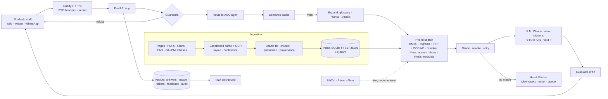

| Layer | Technology |
|---|---|
| API and UI | FastAPI, Uvicorn, server-sent events; vanilla JS/HTML/CSS with no build step and a strict CSP |
| Retrieval | SQLite FTS5 (BM25 + trigram tokenizer), in-memory BM25, RRF; optional `sentence-transformers` BGE-M3, Qdrant, bge-reranker-v2-m3 |
| Models | Claude (Anthropic API, native citations, Batch API for contextual retrieval) or any OpenAI-compatible local server (vLLM, Ollama, llama.cpp, TGI) |
| OCR | PyMuPDF, Pillow pre-processing, Tesseract (`ara+eng`), Claude or local vision model |
| Storage | SQLite (index, AppDB: answers, usage, tickets, feedback, audit), JSONL encrypted logs, optional Redis for the semantic cache |
| Security | PyJWT/JWKS, Fernet, rate limiter, sandboxed parsing (fork + rlimits), bandit, pip-audit, hash-pinned lockfile, CycloneDX SBOM |
| Quality | pytest (205 tests), axe-core with Playwright and Chromium, golden/dev/held-out/thesis eval sets, 30-attack red team |
| Deploy | Docker (non-root, read-only filesystem), docker-compose with Caddy and optional Qdrant, GitHub Actions CI |

```
agentkit/               app: rag.py · store_sqlite.py · chat.py · critic.py · semcache.py · llm.py · local_llm.py
                        api.py · dashboard.py · budget.py · gaps.py · citations.py · harvest.py · ocr.py · security.py
agentkit/static/        chat, staff dashboard, request form, privacy page, widget (accessible, bilingual)
plugins/<division>/     20 agents in 4 Claude Code plugins (core, rag, chat, auc-library) + lean-agent-authoring skill
knowledge/auc-library/  seed pages, librarians, referrals, related topics, sign-off record
config/                 access levels per directory group, ingestion allowlist, local model pool example
evals/                  golden (40), dev (25), held-out (20), theses (30), red team (30), agent smoke tests
docs/                   plans 01–07, evaluation log, pilot plan, runbook, data policy, deploy, staff guide
scripts/                lint, install, benchmarks, OCR bench, load test, screenshots
```

---

## Quick start

**Docker (recommended):**
```bash
cp .env.example .env            # set DOMAIN, ANTHROPIC_API_KEY (or AGENTKIT_LLM=local), AGENTKIT_LOG_KEY, SSO settings
docker compose up -d            # HTTPS chat at https://$DOMAIN, staff dashboard at /admin
```

**Local, no API key needed** (a deterministic extractive stand-in answers offline):
```bash
pip install -e ".[dev]"                                    # add ".[dense,qdrant,tesseract,redis]" as needed
agentkit --index data/index.db ingest knowledge/auc-library/pages
agentkit --index data/index.db serve                       # http://127.0.0.1:8000 · /admin · /metrics
agentkit --index data/index.db ask "ممكن الخريجين يستعيروا كتب؟" --debug
```

**Everyday commands:**
```bash
agentkit eval --set golden|dev|heldout|theses   # question sets with recall@k, MRR, citation, quote and style checks
agentkit redteam                                # 30 attacks: EN/AR/Franco, direct and planted in documents
agentkit preflight                              # go/no-go before real users
agentkit harvest-theses https://fount.aucegypt.edu/do/oai/ --limit 100 --ingest   # endpoint [VERIFY]
agentkit tickets-check && agentkit freshness    # daily cron: SLA escalation, stale sources
agentkit snapshots && agentkit rollback         # undo a bad ingest
agentkit export-searchable scan.pdf -o out.pdf  # OCR text layer for a scan
pytest -q                                       # 205 tests including real-browser accessibility
```

The main settings are listed in [`.env.example`](.env.example): models, budget and alerts, SSO, connectors (LibCal, Primo, Alma, LibAnswers), SMTP, retention, roles, critic, semantic cache, local models and harvesting.

---

## Server requirements

Measured on this repository: the app uses about **80 MB RSS** serving the seed corpus. SQLite search p95 is **40 ms at 20k chunks** on 4 vCPU (232 ms at 100k). The HTTP load test (20 clients, offline model, cache off) ran at **218 req/s** with p95 105 ms. With Claude, answer latency is dominated by the model call (estimate: 1–4 s streamed; research answers held for the critic add one fast-model call). The app server needs no GPU.

| Tier | Typical use | CPU | RAM | Disk | Notes |
|---|---|---|---|---|---|
| **Pilot** | one school, ≤ 50 concurrent users, ≤ 20k chunks | 2 vCPU | 4 GB | 20 GB SSD | single container + Caddy; Claude API |
| **Production** | whole university, ≤ 100k chunks, nightly OCR ingestion | 4–8 vCPU | 8–16 GB | 100 GB SSD | Tesseract ingestion uses all cores (`--workers`); keep 10 snapshots |
| **Large corpus** | full repository of theses, > 200k chunks, dense retrieval | 8–16 vCPU (+ optional T4/L4 GPU for embedding) | 32 GB | 250 GB+ NVMe | BGE-M3 vectors are 1024-d float32 ≈ 4 KB each (≈ 2 GB per 500k chunks) plus Qdrant index; reranker adds ~1–2 GB RAM |

- **OS and runtime:** Linux x86-64, Docker 24+ (or Python 3.10–3.12), Tesseract with Arabic data for OCR.
- **Network:** inbound 443 to Caddy only (the app port is internal). Outbound HTTPS to `api.anthropic.com` (Claude mode), LibCal/Primo/Alma/LibAnswers APIs and the repository OAI endpoint. None of this is needed in local-model mode except the library APIs.
- **Backups:** the index (`data/index.db` + snapshots), `data/app.db` and the encrypted logs. Rebuilding the index from sources is also possible.
- **One process per container.** The circuit breaker and budget live in the server process; run several containers behind Caddy only with Redis for the semantic cache, and expect each process to apply the budget on its own.

---

## Running on local models

Set `AGENTKIT_LLM=local` to keep every question inside the university network. The app talks to any server with the OpenAI-compatible chat API (vLLM, Ollama, llama.cpp, TGI, LM Studio). It can use **several local models at once**, each with a role:

| Role | Used for | Size that works well |
|---|---|---|
| `answer` | writing cited answers and search strategies | 14B–72B instruct model |
| `fast` | relevance grading, query rewriting, the critic | 3B–8B instruct model |
| `vision` | OCR of scanned pages (else Tesseract) | 7B vision-language model |
| `answer` + `langs: ["ar","arabizi"]` | Arabic and Franco-Arabic questions | Arabic-strong model |

Copy [`config/local-models.example.json`](config/local-models.example.json) to `config/local-models.json`:

```json
{"models": [
  {"name": "main",   "url": "http://gpu1:8000/v1",  "model": "Qwen/Qwen2.5-32B-Instruct-AWQ", "roles": ["answer"], "priority": 1},
  {"name": "arabic", "url": "http://gpu2:8000/v1",  "model": "<Arabic-strong model>", "roles": ["answer"], "langs": ["ar", "arabizi"]},
  {"name": "fast",   "url": "http://gpu2:8001/v1",  "model": "Qwen/Qwen2.5-7B-Instruct", "roles": ["fast"]},
  {"name": "vision", "url": "http://gpu2:8002/v1",  "model": "Qwen/Qwen2.5-VL-7B-Instruct", "roles": ["vision"]},
  {"name": "backup", "url": "http://cpu1:11434/v1", "model": "qwen2.5:7b", "roles": ["answer", "fast"], "priority": 9}
]}
```

How a request is routed:
1. A call asks for a role. Servers that list the question's language, or the routed agent, are tried first, then the others by `priority`.
2. If a server fails, the next one is tried.
3. If all fail, the app answers from search results with a banner.

Local models have no native citation API, so answers are prompted to cite `[n]`. Invalid numbers are dropped, and each cited source gets its best-matching sentence as the verbatim quote, so the critic and citation checks work as they do with Claude. The System tab lists each server with its requests and failovers; costs show tokens per model at $0.

### What data leaves the university
| Mode | Leaves AUC | Stays inside |
|---|---|---|
| Claude | the redacted question, the retrieved passages and the system prompt, sent over HTTPS to the Anthropic API | identities, account data (Alma answers never reach a model), logs, dashboard data, documents |
| Local models | nothing (only library APIs such as LibCal/Primo, as in Claude mode) | everything |

### Failover order
1. Local servers in pool order: language or agent preference first, then `priority`. A busy server (all `max_concurrency` slots taken for `AGENTKIT_LOCAL_QUEUE_WAIT` seconds) is skipped.
2. When every server for a role fails: answers come from search results with a banner, OCR falls back to Tesseract, and the optional checks are skipped.

Claude is never called automatically from local mode, so data stays inside.

### Recommended models
These are starting points; run `agentkit eval --set golden|dev|heldout|theses` on your hardware before choosing, because Arabic dialect quality varies a lot between models. Check each licence for university use [VERIFY].

| Use | Model | Params | Licence | Why |
|---|---|---|---|---|
| Answers, one GPU | Qwen2.5-14B-Instruct | 14B | Apache 2.0 | strong English and Arabic, follows citation instructions; 32k context (128k with YaRN) |
| Answers, best quality per GPU | Qwen2.5-32B-Instruct (AWQ) | 32B | Apache 2.0 | noticeably better reasoning and Arabic than 14B; fits one 48 GB GPU at 4-bit |
| Answers, top quality | Qwen2.5-72B-Instruct or Llama-3.3-70B-Instruct | 70–72B | Qwen licence / Llama 3.3 Community | closest to hosted models; needs 2× 48 GB or 1× 80 GB at 4-bit |
| Arabic-focused | Command R7B Arabic; ALLaM-7B-Instruct; Jais family | 7–30B | CC-BY-NC (Command R7B Arabic) / check each | trained for Arabic and RAG; compare on the dialect rows of the eval sets |
| Fast checks | Qwen2.5-7B-Instruct, or Llama-3.2-3B-Instruct on CPU | 3–8B | Apache 2.0 / Llama 3.2 Community | grading, rewriting and critic need short outputs only |
| Vision OCR | Qwen2.5-VL-7B-Instruct; Qwen2.5-VL-72B for manuscripts | 7–72B | Apache 2.0 / Qwen licence | reads Arabic print and tables from images |
| Embeddings and reranker | BAAI/bge-m3, BAAI/bge-reranker-v2-m3 | 0.6B | MIT / Apache 2.0 | already supported (`AGENTKIT_DENSE=1`, `AGENTKIT_RERANK=1`); multilingual including Arabic |

Newer families such as Qwen3 and Gemma 3 are also worth testing on the same eval sets before adopting.

### GPU memory and hardware

**All figures in this section are estimates, not measurements on this project; measure on your hardware.** Rule of thumb for model weights: parameters × bytes per parameter. BF16 is 2 bytes, INT8 is 1, and 4-bit AWQ/GPTQ is about 0.55–0.6. Add 20–40 % for the KV cache at 8–16 concurrent requests with 8–16k context.

| Model size | 4-bit (AWQ/GPTQ) | 8-bit | BF16 |
|---|---|---|---|
| 3B | ~2.5 GB | ~4 GB | ~7 GB |
| 7–8B | ~5–6 GB | ~9 GB | ~16 GB |
| 14B | ~10 GB | ~16 GB | ~30 GB |
| 32B | ~20 GB | ~35 GB | ~65 GB |
| 70–72B | ~42 GB | ~75 GB | ~145 GB |

| Setup | GPUs | Runs | Host |
|---|---|---|---|
| **Small pilot** (estimate) | 1× 24 GB (RTX 4090, L4, A10G) | 14B AWQ answers + 3B fast; Tesseract for OCR | 8 vCPU, 32 GB RAM, 200 GB NVMe |
| **Recommended** (estimate) | 1× 48 GB (L40S, RTX 6000 Ada, A6000) or 2× 24 GB | 32B AWQ answers + 7B fast + 7B vision | 16 vCPU, 64 GB RAM, 500 GB NVMe |
| **Large** (estimate) | 2× 80 GB (A100/H100) | 72B AWQ answers (tensor parallel) + Arabic 7B + 7B fast + vision | 32 vCPU, 128 GB RAM, 1 TB NVMe |
| **CPU only (demo)** | none | 3–8B Q4 GGUF with Ollama/llama.cpp; a few tokens/s per user | 16+ cores, 32 GB RAM |

Serving examples:
```bash
# vLLM (production: batching, many users)
vllm serve Qwen/Qwen2.5-32B-Instruct-AWQ --port 8000 --max-model-len 16384 --gpu-memory-utilization 0.85
vllm serve Qwen/Qwen2.5-7B-Instruct --port 8001 --max-model-len 8192 --gpu-memory-utilization 0.25
# Ollama (simple, CPU or GPU)
ollama pull qwen2.5:7b && ollama serve          # OpenAI-compatible at http://host:11434/v1
```

### Decision models (research, not enabled)
Several pipeline steps are typed decisions rather than prose:
- the guard ("is this an injection?");
- the route ("which agent?");
- relevance grading ("does passage n help?");
- the critic ("pass or fix?").

"System one" decision models that answer typed questions in one forward pass could make these steps faster and calibrated. [kyegomez/open-jev](https://github.com/kyegomez/open-jev) is an unofficial PyTorch reconstruction of that idea. It ships **random, untrained weights**, so it would first have to be trained on our labelled sets (golden, dev, red team) and beat the current rules on them. That plan is in [plan 8](docs/plans/08-decision-models.md); nothing in the app depends on it.

---

## Quality and evaluation

Offline numbers below use the deterministic extractive stand-in. Retrieval numbers carry over to live mode; answer wording does not. Every run is logged with its exact numbers, including failures, in [`docs/EVALUATION-LOG.md`](docs/EVALUATION-LOG.md).

| Check | Result |
|---|---|
| Golden questions (40: 23 EN, 12 Arabic, 5 Franco), JSON and SQLite | **40/40**, recall@5 1.0, MRR 1.0, also with critic and semantic cache on |
| Held-out (20, never tuned on) | **11/20** on the blind run; 16/20 after general fixes; recall@5 1.0 |
| Thesis search (30, fictional repository) | first run 20/30 (recall 0.778); now 25/30, recall 0.893 (target 0.9: cross-language topics need BGE-M3 or a live model) |
| Red team | **30/30** attacks blocked |
| Accessibility | axe-core WCAG 2.2 AA: **0 violations** on chat (EN/AR), all 14 dashboard tabs, request and privacy pages |
| OCR bench (Tesseract, synthetic) | CER 0.000 on clean/rotated/blurred/noisy/low-res EN and AR; diacritized Arabic routed to staff correction |
| Tests and security | 205 tests; bandit 0 medium/high; pip-audit 0; hash-pinned lockfile; SBOM in CI |
| Independent review | three rounds with two other models: **OK** from both for entering the gated pilot |

---

## Agent Kit

20 lean agent definitions (about 35 lines each, versus 200–300 in [agency-agents](https://github.com/msitarzewski/agency-agents), the inspiration), packaged as Claude Code plugins.

```
/plugin marketplace add <owner>/<repo>
/plugin install agent-kit-core@agent-kit          # build agents for any use (+ lean-agent-authoring skill)
/plugin install agent-kit-rag@agent-kit           # RAG + OCR
/plugin install agent-kit-chat@agent-kit          # chatbot design, guardrails, Arabic
/plugin install agent-kit-auc-library@agent-kit   # AUC Libraries assistants
```
Other tools: `scripts/install.sh cursor|agents-md|claude`. Then ask: *"Use agent-architect to make me an agent that triages support emails."*

| Plugin | Agent | Model | Use when… |
|---|---|---|---|
| core | `agent-architect` | inherit | you need a **new agent for any purpose** |
| | `orchestrator` | inherit | a task needs several agents |
| | `prompt-engineer` | inherit | a prompt is weak, inconsistent or costly |
| | `evaluator` | sonnet | you need to prove it works (golden tests, CI thresholds) |
| | `evaluator-critic` | haiku | a drafted answer must be checked against its sources before users see it |
| | `mcp-tool-builder` | inherit | an agent needs safe access to data or actions over MCP |
| rag | `rag-architect` | inherit | designing a RAG system (hybrid + RRF + rerank + citations) |
| | `ocr-document-engineer` | sonnet | scanned or photographed PDFs, broken Arabic text layers |
| | `rag-ingestion-engineer` | sonnet | sentence-aware chunking, metadata, injection quarantine |
| | `rag-retrieval-engineer` | inherit | retrieval returns wrong or missing chunks |
| | `rag-evaluator` | sonnet | recall@k, MRR, citations, faithfulness |
| chat | `chatbot-architect` | inherit | building a chat assistant |
| | `chat-guardrails` | inherit | hardening against the OWASP Top 10 for LLM apps |
| | `arabic-english-localizer` | sonnet | Arabic (MSA/Egyptian/Franco-Arabic) + English users |
| auc-library | `auc-library-concierge` | haiku | front desk: borrowing, access, hours, services |
| | `auc-research-assistant` | sonnet | sources, databases, search strings, citations |
| | `auc-catalog-navigator` | haiku | a specific item, call number, availability, theses |
| | `auc-special-collections-guide` | sonnet | rare books, archives, manuscripts, photographs |
| | `auc-library-rag-builder` | inherit | building the knowledge base behind the AUC agents |
| | `library-systems-integrator` | inherit | Primo/Alma, LibCal, LibAnswers, OAI-PMH connectors |

---

## Documentation

| Topic | Document |
|---|---|
| Plans and decisions | [research](docs/research/FINDINGS.md) · [plan 2](docs/plans/02-enhancement-plan.md) · [plan 3: secure, scale, accessible](docs/plans/03-scale-secure-accessible.md) · [plan 4: library services](docs/plans/04-review-features.md) · [plan 5: review round 1](docs/plans/05-review-round1.md) · [plan 6: agentic retrieval](docs/plans/06-agentic-rag.md) · [plan 7: dashboard, costs, research tools](docs/plans/07-analytics-governance-research.md) · [plan 8: decision models](docs/plans/08-decision-models.md) |
| Results | [evaluation log](docs/EVALUATION-LOG.md) |
| Operations | [deploy](docs/DEPLOY.md) · [pilot plan](docs/PILOT.md) · [runbook](docs/RUNBOOK.md) · [staff guide](docs/STAFF-GUIDE.md) · [data policy](docs/DATA-POLICY.md) |
| Building agents | [agent design guide](docs/AGENT-DESIGN.md) · [template](templates/agent.template.md) |

## Path to production
1. **Confirm the facts.** AUC staff check [`knowledge/auc-library/`](knowledge/auc-library/) and fill every `[VERIFY]`.
2. **Get permission** to crawl the library site, use its APIs and harvest open-access theses; record it in `signoff.json`.
3. **Ingest** the site, scans and theses; turn on `AGENTKIT_DENSE=1` for large corpora.
4. **Run the live evals** with Claude or your local models, then `agentkit preflight` until it prints "ready for real users".
5. **Pilot** with one school for four weeks ([PILOT.md](docs/PILOT.md)), with `AGENTKIT_PILOT=1`.

## Roadmap
Trained decision model for guard/route/grade ([plan 8](docs/plans/08-decision-models.md)) · speech-to-text for WhatsApp voice notes · Postgres/pgvector back end for multi-writer deployments · shared budget counter across processes.

## License
MIT. The agent persona format is adapted from agency-agents (MIT, © msitarzewski); answer-style rules adapted from antislop (MIT).
